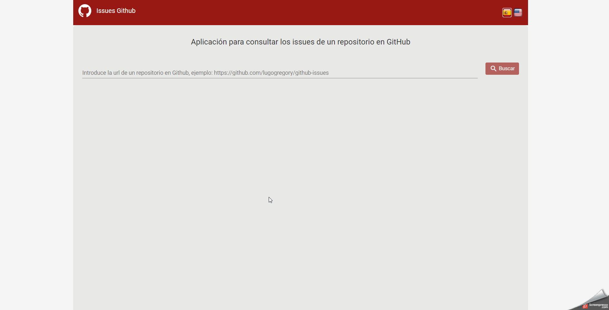

# Issue viewer on Github

This project was generated with [Angular CLI](https://github.com/angular/angular-cli) version 9.0.5.

## Description
Multi language application SPA that works as a repository issue viewer in Github, you can navigate to the detail view to see the comments and additional information.

## Demo

## Live demo from HEROKU
https://github-issues-get.herokuapp.com/total-issues

## Includes
1. SCSS styles, Bootstrap
2. Angular Material
3. Ng-translate
4. Ngx-toastr
5. Ngrx, actions, reducers, effects, selectors, states
6. Async pipe para las subscripciones.

## Run project from local

1. To execute the project CLONE the repository (download the .ZIP)
2. Run `npm install` to add dependencies
3. Run `ng serve`, and navigate to the route `http://localhost:4200/`
